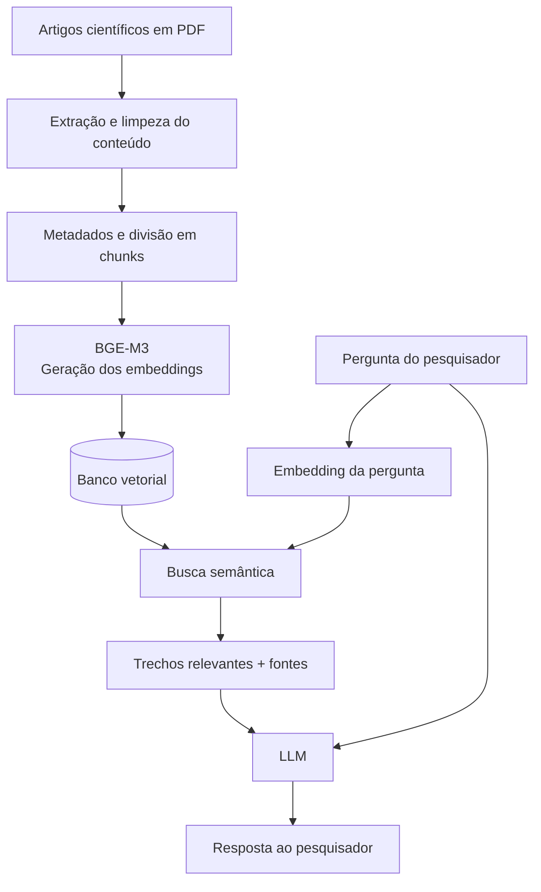

# Cenário 1 — Assistente para Pesquisa e Revisão de Literatura Científica

## Parte 1 — Identificação do problema

## 1.1 Descrição do problema

**Qual é o problema que você deseja resolver?**  
Durante uma pesquisa, é comum acumular muitos artigos sobre o mesmo tema. Com o tempo, fica difícil encontrar novamente uma informação, comparar o que diferentes autores dizem e localizar fontes úteis para a fundamentação teórica.

**Quem utilizaria a aplicação?**  
Estudantes de graduação, pós-graduação e pesquisadores que estejam desenvolvendo TCC, artigos ou revisões de literatura. O usuário não precisaria ter conhecimento técnico sobre RAG ou embeddings.

**Que tipo de informação o usuário gostaria de consultar?**  
Conceitos, métodos, resultados, limitações, conclusões e diferenças entre os trabalhos da sua biblioteca.

**De onde vêm essas informações?**  
Dos artigos científicos adicionados pelo próprio usuário ao sistema.

**Por que utilizar um LLM sozinho não seria suficiente?**  
Porque a intenção é responder com base nos artigos escolhidos pelo pesquisador, e não apenas no conhecimento geral do modelo. Um LLM também pode não conhecer trabalhos recentes ou pode trazer informações que não aparecem nas fontes usadas pelo usuário.

**Como o usuário vai utilizar o sistema?**  
Por meio de uma interface web em formato de chat, na qual ele adiciona seus artigos e faz perguntas sobre o conteúdo da biblioteca.

**Três perguntas reais que poderiam ser feitas ao sistema:**

1. Quais limitações sobre RAG aparecem nos artigos da minha biblioteca?
2. O que esses trabalhos apresentam de diferente sobre o uso de IA na educação?
3. Quais artigos podem me ajudar a fundamentar uma discussão sobre riscos no uso de modelos de linguagem?

---

## 1.2 Por que RAG?

**Por que RAG é adequado para esse problema?**  
Porque o sistema precisa primeiro buscar informações dentro dos artigos do próprio pesquisador e depois usar esses trechos para gerar uma resposta.

**Que tipo de conhecimento precisa ser fornecido ao modelo?**  
Trechos dos artigos relacionados à pergunta, como resultados, métodos, limitações e conclusões, junto com informações sobre a fonte.

**Esse conhecimento muda com que frequência?**  
Não existe uma frequência fixa. A base muda sempre que o pesquisador adiciona novos artigos à sua biblioteca.

**Existe necessidade de utilizar documentos privados ou específicos da organização?**  
Os documentos são específicos de cada usuário, pois cada pesquisador possui sua própria biblioteca. Alguns materiais também podem ter acesso restrito.

**Que problemas poderiam ocorrer se o LLM respondesse apenas com seu conhecimento pré-treinado?**  
Ele poderia responder de forma genérica, utilizar informações que não estão na biblioteca ou não conhecer um artigo recente.

**Exemplo concreto de resposta errada:**  
Se o usuário perguntar “Quais dos meus artigos falam sobre limitações de RAG?”, um LLM sem acesso à biblioteca poderia apresentar limitações gerais sobre RAG ou citar trabalhos que nem fazem parte do acervo do pesquisador.

### 1.3 Limitações — quando RAG não é a resposta

RAG não seria necessário para todas as consultas.

- **Busca por palavra-chave:** seria melhor quando o usuário quiser encontrar uma expressão exata dentro dos artigos.
- **Banco de dados/SQL:** seria melhor para perguntas como "Quantos artigos foram publicados em 2025?" ou para ordenar os artigos por data.
- **API:** poderia ser usada para buscar informações atualizadas sobre um artigo a partir do DOI.
- **Regras:** poderiam impedir, por exemplo, a inclusão de arquivos duplicados ou inválidos.

Uma pergunta que RAG responderia mal seria:

> "Quantos artigos da minha biblioteca foram publicados em 2024?"

Nesse caso, uma consulta aos metadados seria mais confiável.

Se fosse necessário contar, somar ou ordenar informações de muitos documentos, eu também não usaria apenas RAG, porque a busca recupera os trechos mais relevantes e não necessariamente todos os documentos da base.

Por isso, o sistema poderia combinar RAG com busca tradicional, banco de dados e APIs dependendo do tipo de pergunta.

## Parte 2 — Organização dos documentos

A base seria formada principalmente por artigos científicos em **PDF**. Também poderiam ser aceitos artigos em HTML ou Markdown.

Inicialmente, pensei em uma biblioteca pessoal com **dezenas ou algumas centenas de artigos**, com documentos geralmente entre 5 e 30 páginas.

Novos artigos entrariam sempre que o pesquisador adicionasse um arquivo à sua biblioteca.

### Organização das pastas

documentos/
├── artigos/
├── suplementos/
└── arquivados/

A pasta `artigos` teria os trabalhos usados na pesquisa. `suplementos` guardaria materiais complementares dos artigos e `arquivados` teria documentos que não devem mais aparecer normalmente nas buscas.

### Documentos que não devem entrar na base

Arquivos duplicados, corrompidos ou que não possam ser processados corretamente não seriam indexados. Também seria necessário respeitar possíveis restrições de acesso aos documentos.

### Versões

Se existirem versões diferentes do mesmo trabalho, cada uma teria sua versão identificada nos metadados. Por padrão, a busca utilizaria a versão mais recente, evitando recuperar conteúdo desatualizado.

## Parte 3 — Pipeline de ingestão

### 3.1 Extração

Os artigos em PDF com texto selecionável seriam processados diretamente para extrair o conteúdo.

Se o PDF fosse digitalizado, seria necessário usar OCR para reconhecer o texto.

As tabelas seriam mantidas quando apresentassem resultados importantes. Imagens decorativas poderiam ser ignoradas, mas gráficos e figuras relevantes deveriam manter pelo menos a legenda ou uma descrição.

Um problema possível é a extração vir com quebras de linha erradas, palavras separadas ou partes do documento fora de ordem.

### 3.2 Limpeza e normalização

Seriam removidos elementos repetidos, como cabeçalhos, rodapés e numeração de página quando não fossem úteis.

Também seriam corrigidos espaçamentos, quebras de linha e problemas de codificação.

A limpeza não poderia ser exagerada, porque informações como títulos de seção, legendas e referências podem ser importantes para entender e citar o conteúdo.

### 3.3 Frequência de ingestão

O processamento aconteceria sempre que o usuário adicionasse um novo artigo.

Se um documento fosse alterado, apenas ele seria processado novamente, e não toda a base.

Para identificar alterações, poderiam ser usados dados como `document_id`, versão ou hash do arquivo.

## Parte 4 — Metadados

### 4.1 Metadados do documento

```json
{
  "document_id": "artigo_001",
  "titulo": "Título do artigo",
  "autores": ["Autor A", "Autor B"],
  "ano": 2026,
  "doi": "10.xxxx/xxxxx",
  "fonte": "artigo.pdf",
  "idioma": "pt",
  "versao": 1
}
```

Esses metadados permitem identificar o artigo, filtrar por autor, ano ou idioma e manter o controle das versões. O DOI também ajuda a identificar a publicação original.

### 4.2 Metadados do chunk

```json
{
  "document_id": "artigo_001",
  "chunk_id": "artigo_001_05",
  "chunk_index": 5,
  "pagina": 7,
  "secao": "Resultados",
  "ano": 2026
}
```

O `chunk_id` identifica cada trecho e o `chunk_index` mostra sua posição no documento. A página e a seção ajudam a localizar a informação original.

Para **filtrar a busca**, poderiam ser usados campos como autor, ano e idioma. Por exemplo: "Quais artigos publicados depois de 2023 discutem RAG?"

Para **citar a fonte**, seriam usados título, autor, página e DOI. A resposta poderia mostrar: `Fonte: Silva et al. (2026), página 7`.

Metadados como página e seção seriam difíceis de adicionar depois, pois seria necessário relacionar novamente cada chunk com sua posição no documento original.

Os metadados seriam extraídos do próprio artigo durante o processamento. Alguns campos, como título, autores e DOI, também poderiam ser conferidos em bases acadêmicas.

## Parte 5 — Chunking / Splitting

Para os artigos científicos, eu usaria uma divisão baseada primeiro nas seções do artigo, como introdução, metodologia, resultados e conclusão. Se uma seção fosse muito grande, usaria o splitter recursivo para dividi-la em partes menores.

Como ponto inicial, usaria chunks de aproximadamente **1000 caracteres**, com **overlap de 100 caracteres**. Essa configuração pode ser ajustada depois de testar a qualidade da recuperação.

Escolhi essa estratégia porque quero evitar que uma explicação seja cortada no meio, mas também não quero chunks muito grandes contendo vários assuntos diferentes.

- **Chunks muito pequenos:** podem perder o contexto da informação.
- **Chunks muito grandes:** podem misturar assuntos e prejudicar a busca.
- **Tabelas:** tentaria mantê-las inteiras, junto com o cabeçalho, porque cortar uma tabela pode fazer os valores perderem o sentido.
- **Imagens:** imagens relevantes seriam associadas à legenda ou a uma descrição textual.

Para avaliar se o chunking ficou bom, eu faria perguntas sobre informações que sei que existem nos artigos e verificaria se os trechos corretos aparecem entre os primeiros resultados da busca.

## Parte 6 — Embeddings

Para esse cenário, eu escolheria o modelo `BAAI/bge-m3`.

### Comparação dos modelos pesquisados

| Item | BGE-M3 | Jina Embeddings v3 | multilingual-e5-large |
|---|---|---|---|
| Dimensão do embedding | 1024 | até 1024 | 1024 |
| Suporta português | Sim | Sim | Sim |
| Multilíngue | Sim, mais de 100 idiomas | Sim | Sim |
| Tamanho máximo de entrada | 8192 tokens | 8192 tokens | 512 tokens |
| Licença | MIT | CC BY-NC 4.0 | MIT |
| Pode ser executado localmente | Sim | Sim | Sim |
| Possui API | Sim, por provedores | Sim, pela Jina AI | Sim, por provedores |
| Custo aproximado | Cerca de US$ 0,01 por 1 milhão de tokens via OpenRouter; localmente não há cobrança por token, mas existem custos de infraestrutura | Cerca de US$ 0,045 a US$ 0,05 por 1 milhão de tokens na API da Jina | Depende do provedor; localmente não há cobrança por token, mas existem custos de infraestrutura |

Escolhi o BGE-M3 porque ele é multilíngue, suporta português e inglês e foi desenvolvido para tarefas de recuperação de informação. Isso combina com uma biblioteca científica que pode ter artigos nos dois idiomas.

Também considerei o Jina Embeddings v3 e o multilingual-e5-large. O Jina v3 também é adequado para retrieval, mas possui uma licença mais restritiva para uso comercial. O multilingual-e5-large também é multilíngue, porém aceita entradas menores, de até 512 tokens.

Como alguns artigos podem ter acesso restrito, a execução local pode ser interessante para evitar o envio dos textos para uma API externa.

O limite máximo de entrada também influencia o chunking. Mesmo o BGE-M3 aceitando até 8192 tokens, eu manteria chunks menores para evitar misturar assuntos diferentes e facilitar a recuperação de trechos mais específicos.


## Arquitetura final

### Diagrama da arquitetura



### Tabela de decisões

| Etapa | Decisão | Justificativa |
|---|---|---|
| Extração | Extração direta de PDFs e OCR quando necessário | Os artigos podem ser digitais ou escaneados |
| Limpeza | Remover ruídos sem apagar títulos, seções e informações importantes | A estrutura do artigo ajuda na recuperação e na citação |
| Chunking | Divisão por seções e splitter recursivo para partes grandes | Preserva melhor o contexto do artigo |
| Metadados | Título, autores, ano, DOI, página e seção | Permitem filtrar a busca e citar a fonte |
| Embeddings | BGE-M3 | É multilíngue, voltado para retrieval e suporta textos longos |

### Riscos e limitações

A arquitetura depende da qualidade da extração e da recuperação dos chunks. Um artigo mal convertido pode gerar informações incompletas ou incorretas.

Também existe o risco de a busca não recuperar todos os trabalhos relevantes para uma pergunta. Por isso, a resposta do sistema deve sempre apresentar as fontes utilizadas.

O sistema também não substitui a leitura crítica dos artigos. Ele serviria como apoio para localizar e comparar informações.

# Referências

- BAAI. **BGE-M3**. Hugging Face. Disponível em: https://huggingface.co/BAAI/bge-m3. Acesso em: 20 ago. 2026.

- CHEN, Jianlv et al. **BGE M3-Embedding: Multi-Lingual, Multi-Functionality, Multi-Granularity Text Embeddings Through Self-Knowledge Distillation**. arXiv, 2024. Disponível em: https://arxiv.org/abs/2402.03216. Acesso em: 20 ago. 2026.

- JINA AI. **jina-embeddings-v3**. Hugging Face. Disponível em: https://huggingface.co/jinaai/jina-embeddings-v3. Acesso em: 20 ago. 2026.

- INTFLOAT. **multilingual-e5-large**. Hugging Face. Disponível em: https://huggingface.co/intfloat/multilingual-e5-large. Acesso em: 20 ago. 2026.

- OPENROUTER. **BAAI: BGE-M3**. Disponível em: https://openrouter.ai/baai/bge-m3. Acesso em: 20 ago. 2026.

- WANG, Liang et al. **Multilingual E5 Text Embeddings: A Technical Report**. arXiv, 2024. Disponível em: https://arxiv.org/abs/2402.05672. Acesso em: 20 ago. 2026.