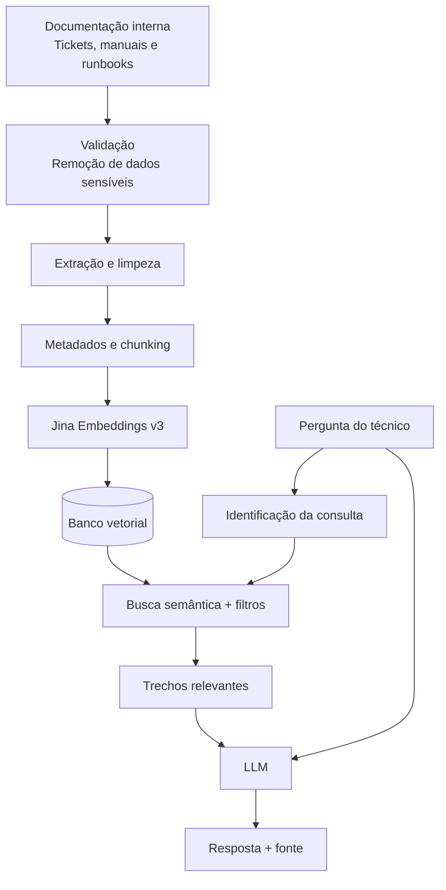

# Cenário 2 — Assistente Interno para Suporte Técnico de Software

## Parte 1 — Identificação do problema

### 1.1 Descrição do problema

**Qual é o problema que você deseja resolver?**  
Em uma empresa de tecnologia, informações importantes podem ficar espalhadas entre documentação, manuais, procedimentos internos e registros de problemas já resolvidos. Isso pode fazer com que desenvolvedores e profissionais de suporte gastem tempo procurando uma solução que já existe.

**Quem utilizaria a aplicação?**  
Desenvolvedores e profissionais de suporte técnico da empresa. Eles teriam conhecimento técnico sobre os sistemas, mas não necessariamente conheceriam toda a documentação ou o histórico de problemas anteriores.

**Que tipo de informação o usuário gostaria de consultar?**  
Procedimentos de configuração, erros conhecidos, soluções de incidentes anteriores, documentação de APIs, manuais e informações sobre versões dos sistemas.

**De onde vêm essas informações?**  
Da documentação interna da empresa, manuais, runbooks, tickets resolvidos, base de conhecimento e documentação de APIs.

**Por que utilizar um LLM sozinho não seria suficiente?**  
Porque um LLM não conhece os sistemas internos da empresa, nem os procedimentos, versões e problemas registrados pela equipe.

**Como o usuário vai utilizar o sistema?**  
Por meio de uma interface web interna, com autenticação, onde o usuário descreve o problema e recebe informações encontradas na base de conhecimento.

**Três perguntas reais que poderiam ser feitas ao sistema:**

1. Esse erro de autenticação já aconteceu antes? Como foi resolvido?
2. Qual é o procedimento atual para configurar o ambiente do projeto?
3. Depois da versão 4.2, mudou alguma coisa no fluxo de autenticação?

---

### 1.2 Por que RAG?

**Por que RAG é adequado para esse problema?**  
Porque a resposta depende de informações internas e específicas da empresa. O sistema pode buscar trechos relevantes da documentação antes de gerar a resposta.

**Que tipo de conhecimento precisa ser fornecido ao modelo?**  
Documentação técnica, procedimentos, soluções de tickets, informações sobre versões, configurações e registros de problemas anteriores.

**Esse conhecimento muda com que frequência?**  
Com frequência. Novos tickets podem surgir diariamente e a documentação pode mudar sempre que uma nova versão do sistema é lançada.

**Existe necessidade de utilizar documentos privados ou específicos da organização?**  
Sim. Grande parte das informações seria interna da empresa, como procedimentos, arquitetura, configurações e histórico de incidentes.

**Que problemas poderiam ocorrer se o LLM respondesse apenas com seu conhecimento pré-treinado?**  
Ele poderia sugerir uma solução genérica que não corresponde ao ambiente real da empresa ou à versão atual do sistema.

**Exemplo concreto de resposta errada:**  
Se o usuário perguntar como corrigir uma falha no `auth-service`, o LLM poderia sugerir reiniciar um serviço ou alterar uma configuração que não faz parte da arquitetura usada pela empresa.

---

### 1.3 Limitações — quando RAG não é a resposta

**Em quais situações RAG não seria a melhor solução?**

- **Busca por palavra-chave:** quando o técnico já conhece o código exato de um erro, serviço ou configuração.
- **Banco de dados e SQL:** para consultar quantidade de chamados, datas, responsáveis e status dos tickets.
- **Regras determinísticas:** para procedimentos que possuem regras fixas e não devem depender da interpretação do modelo.
- **API:** para consultar informações em tempo real, como estado de um serviço ou status de um chamado.
- **Combinação de técnicas:** o sistema poderia usar RAG para documentação e SQL ou APIs para dados estruturados e atuais.

**Existe alguma pergunta que RAG responderia mal e um banco de dados relacional responderia bem?**  

Sim. Por exemplo:

> Quantos chamados relacionados a erro de autenticação foram registrados no último mês?

Uma consulta SQL seria mais adequada porque precisa contar todos os registros de um período específico.

**O que acontece se for necessário contar, somar ou ordenar informações espalhadas por muitos documentos?**  

O RAG pode recuperar apenas parte dos documentos e gerar um resultado incompleto. Para esse tipo de consulta, seria melhor utilizar dados estruturados em banco de dados.

---

### Organização das pastas

```text
base_conhecimento/
├── documentacao/
├── runbooks/
├── tickets_resolvidos/
├── apis/
└── manuais/
```

---

## Parte 3 — Pipeline de ingestão

O pipeline desse cenário seguiria esta sequência:

```text
Documentos internos
        ↓
Validação
        ↓
Extração
        ↓
Limpeza e normalização
        ↓
Metadados
        ↓
Chunking
        ↓
Embeddings
        ↓
Banco vetorial

```

### Organização das pastas

```text
base_conhecimento/
├── documentacao/
├── runbooks/
├── tickets_resolvidos/
├── apis/
└── manuais/

## Parte 3 — Pipeline de ingestão

O pipeline desse cenário seguiria esta sequência:

```text
Documentos internos
        ↓
Validação
        ↓
Extração
        ↓
Limpeza e normalização
        ↓
Metadados
        ↓
Chunking
        ↓
Embeddings
        ↓
Banco vetorial
```

### 3.1 Extração

**Como o texto seria extraído?**

A forma de extração dependeria do tipo de documento. Arquivos Markdown, HTML e DOCX teriam o texto extraído diretamente. Nos PDFs com texto selecionável também seria feita extração direta.

**Como tratar PDFs digitalizados?**

Quando o PDF fosse apenas uma imagem digitalizada, seria necessário utilizar OCR para transformar o conteúdo em texto.

**Como tratar tabelas?**

Tabelas com informações importantes, como versões, configurações e códigos de erro, deveriam ser preservadas. Cortar uma tabela poderia fazer os dados perderem o sentido.

**Como tratar imagens?**

Imagens apenas decorativas poderiam ser descartadas. Já prints de erros, diagramas de arquitetura ou imagens com informação técnica deveriam ser mantidos ou associados a uma descrição textual.

**Como tratar documentos multimodais?**

Quando o documento misturar texto e imagens importantes, eu tentaria manter a relação entre os dois. Um print de erro, por exemplo, deveria continuar associado ao texto que explica aquele problema.

**Quais problemas podem acontecer durante a extração?**

Podem ocorrer erros de OCR, perda da estrutura das tabelas, códigos mal formatados e separação incorreta entre títulos e conteúdos.

Nesse cenário, isso pode ser um problema porque pequenos detalhes, como uma versão, um comando ou uma mensagem de erro, podem mudar completamente a solução.

---

### 3.2 Limpeza e normalização

**O que precisa ser removido?**

Cabeçalhos e rodapés repetidos, espaços desnecessários, menus de páginas HTML e outros elementos que não ajudam na busca.

**O que precisa ser padronizado?**

Quebras de linha, espaçamento, codificação de caracteres e estrutura dos documentos.

**Que informação pode ser perdida ao limpar demais?**

Códigos de erro, comandos, nomes de serviços, versões, URLs internas e blocos de código. Essas informações precisam ser preservadas porque podem ser essenciais para resolver o problema.

---

### 3.3 Frequência de ingestão

**Com que frequência o pipeline seria executado?**

O pipeline poderia rodar diariamente e também sempre que uma atualização importante fosse publicada.

**Quando um documento for atualizado, a base inteira será reprocessada?**

Não. Apenas o documento alterado seria processado novamente.

**Como saber qual documento precisa ser reprocessado?**

Cada documento teria um identificador, versão e data de atualização. O sistema compararia essas informações com a versão já indexada para identificar alterações.


## Parte 4 — Metadados

### 4.1 Metadados do documento

```json
{
  "document_id": "doc_001",
  "titulo": "Configuração do serviço de autenticação",
  "fonte": "documentacao_interna",
  "tipo_documento": "runbook",
  "sistema": "auth-service",
  "versao": "4.2",
  "data_atualizacao": "2026-08-10",
  "status": "atual"
}
```

Esses metadados ajudam a identificar de qual sistema e versão veio a informação. A data de atualização e o status também são importantes para evitar que uma documentação antiga seja usada como se ainda fosse atual.

### 4.2 Metadados do chunk

```json
{
  "document_id": "doc_001",
  "chunk_id": "doc_001_05",
  "chunk_index": 5,
  "secao": "Erros de autenticação",
  "sistema": "auth-service",
  "versao": "4.2",
  "tipo_documento": "runbook"
}
```

**Quais metadados seriam usados para filtrar a busca?**  
Eu usaria principalmente `sistema`, `versao`, `tipo_documento` e `status`.

Por exemplo, na pergunta:

> Como resolver o erro de autenticação na versão 4.2?

O filtro por versão é importante para evitar recuperar uma solução de uma versão antiga.

**Quais metadados seriam usados para citar a fonte?**  
Título do documento, seção, versão e data de atualização.

A resposta poderia mostrar:

> Fonte: Configuração do serviço de autenticação — seção "Erros de autenticação" — versão 4.2.

**Que metadado seria difícil de acrescentar depois da indexação?**  
A seção e a versão associadas a cada chunk, porque seria necessário voltar aos documentos e relacionar novamente cada trecho com essas informações.

**Como os metadados seriam extraídos?**  
Alguns poderiam vir do próprio sistema de documentação, como título, data e versão. Outros seriam extraídos durante o processamento do documento, como seção e posição do chunk.

---

## Parte 5 — Chunking / Splitting

Eu não utilizaria exatamente a mesma estratégia para todos os documentos desse cenário, porque um ticket de suporte e um manual técnico possuem estruturas diferentes.

Para manuais e documentação, tentaria primeiro dividir o conteúdo por títulos e seções. Se uma seção fosse muito grande, utilizaria um splitter recursivo.

Como ponto inicial, utilizaria chunks de aproximadamente **800 caracteres**, com **overlap de 100 caracteres**.

Nos tickets resolvidos, tentaria manter juntos o problema apresentado, a causa identificada e a solução aplicada. Separar essas partes poderia fazer o trecho perder o sentido.

**O que pode acontecer se os chunks forem muito pequenos?**  
Um chunk pode trazer apenas a mensagem de erro sem trazer a solução ou o contexto em que ela aconteceu.

**O que pode acontecer se os chunks forem muito grandes?**  
Um único chunk pode reunir vários erros, configurações ou procedimentos diferentes, prejudicando a busca.

**Como tratar tabelas?**  
Tentaria manter cada tabela inteira e junto do seu cabeçalho. Uma tabela de versões ou configurações cortada no meio poderia perder o significado.

**Como tratar imagens?**  
Prints de erros e diagramas importantes seriam associados a uma descrição textual. Imagens apenas decorativas poderiam ser descartadas.

**Como saber se a estratégia de chunking ficou boa?**  
Eu criaria perguntas baseadas em problemas reais presentes na documentação e verificaria se os chunks que contêm a solução aparecem entre os primeiros resultados.

---

## Parte 6 — Embeddings

Para este cenário, escolhi o modelo `jinaai/jina-embeddings-v3`.

| Item | Informação |
|---|---|
| Modelo escolhido | `jinaai/jina-embeddings-v3` |
| Dimensão do embedding | Até 1024 dimensões |
| Suporta português? | Sim |
| É multilíngue? | Sim |
| Tamanho máximo de entrada | 8192 tokens |
| É open source? | Pesos disponíveis sob licença CC BY-NC 4.0 |
| Pode ser executado localmente? | Sim |
| Possui API? | Sim |
| Custo aproximado | Gratuito para testes não comerciais; planos pagos em torno de US$ 0,045 a US$ 0,05 por 1 milhão de tokens |
| Fonte | https://huggingface.co/jinaai/jina-embeddings-v3 e https://jina.ai/embeddings/ |

### Por que esse modelo é adequado?

Escolhi o Jina Embeddings v3 porque ele é multilíngue, suporta português e possui recursos voltados para recuperação de informação. Isso combina com a busca em manuais, tickets e documentação técnica.

### Modelo alternativo

Também considerei o BGE-M3, que possui características parecidas e licença MIT. Ele seria uma alternativa interessante principalmente em um cenário comercial.

### Documentos sigilosos

Como a base pode conter informações internas da empresa, eu daria preferência à execução local do modelo, evitando enviar documentos privados para uma API externa.

### Relação com o chunking

Apesar de aceitar até 8192 tokens, eu não usaria chunks próximos desse limite. Chunks menores ajudam a evitar que vários assuntos técnicos diferentes sejam misturados no mesmo vetor.

### Observação sobre a licença

O Jina Embeddings v3 utiliza licença CC BY-NC 4.0. Como o cenário é empresarial, essa limitação precisaria ser analisada antes de uma implantação comercial.
---

# Arquitetura final

## Diagrama



## Tabela de decisões

| Etapa | Decisão | Justificativa |
|---|---|---|
| Extração | Extração de acordo com o formato e OCR quando necessário | A base possui diferentes tipos de documentos |
| Limpeza | Remover ruídos, preservando códigos e informações técnicas | Códigos, comandos e versões podem ser essenciais |
| Chunking | Estratégia diferente para documentação e tickets | Os documentos possuem estruturas diferentes |
| Metadados | Sistema, versão, tipo, seção e atualização | Evita recuperar documentação incompatível ou antiga |
| Embeddings | Jina Embeddings v3 | É multilíngue e possui suporte específico para retrieval |

## Riscos e limitações

O sistema depende da qualidade e da atualização da documentação. Se uma solução estiver errada ou desatualizada na base, o RAG também poderá recuperar essa informação.

Outro risco é recuperar um procedimento correto para uma versão diferente do sistema. Por isso, versão e data de atualização são metadados importantes.

O RAG também não deve executar automaticamente procedimentos críticos apenas porque encontrou uma solução semelhante em um ticket antigo. A resposta deve servir como apoio ao profissional.

Consultas que envolvam informações em tempo real, cálculos ou contagens devem utilizar APIs ou bancos de dados em vez de depender apenas da busca vetorial.
